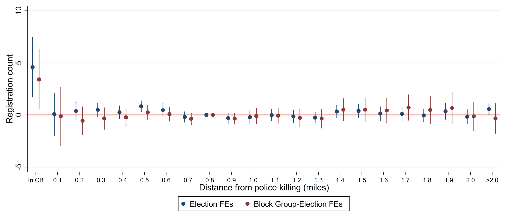
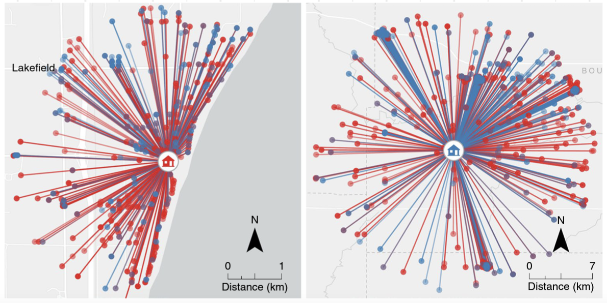
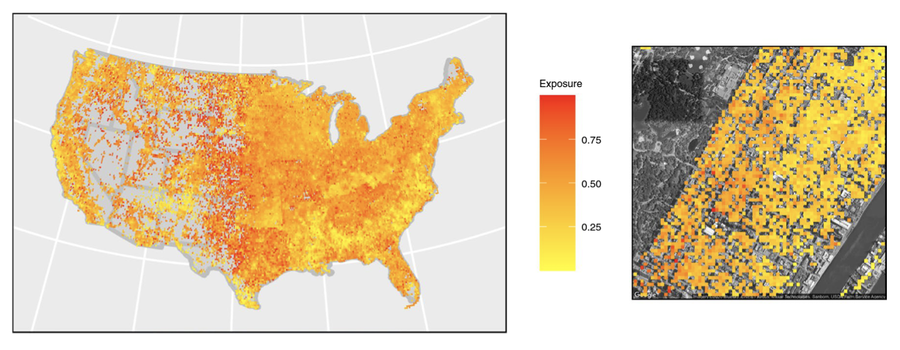
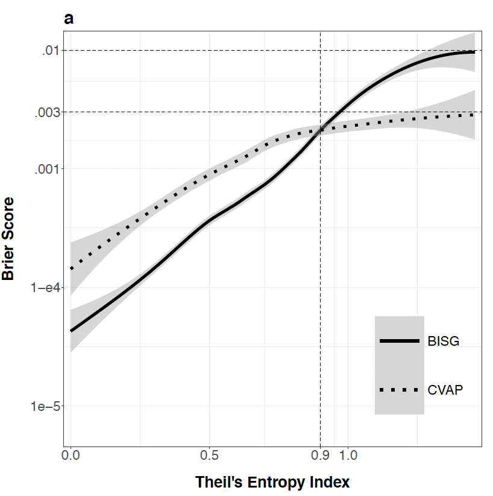

```{r setup, include=FALSE}
knitr::opts_chunk$set(echo = TRUE)
```

This workshop focuses on tools for spatial computation in R. Topics covered are:

  * Social science example papers
  * Possible data sources
  * Simple Features (sf) in R
  * Makin' maps
  * Geocoding
  * Spatial operations
    * Filtering
    * Joining
    * Distances
    * Centroids
    * Interpolation

Spatial computation refers to data wrangling with spatial data. It enables the construction of new datasets and measures by joining otherwise un-linked data across space or measuring the space between objects.

Useful references:

  * Robin Lovelace: [Geocomputation in R](https://geocompr.robinlovelace.net/intro.html)
  * Edzer Pebesma: [sf vignettes](https://r-spatial.github.io/sf/articles/)
  
Note that this workshop does *not* focus on spatial statistics. Spatial statistics refers to a set of statistical models that account for spatial autocorrelation. Many analyses that require spatial statistics involve very little spatial computation, and many analyses that rely on spatial computation do not require any spatial statistics. 

[This article](https://link.springer.com/article/10.1007/s11113-007-9051-8) is a good introduction to spatial statistics, if people want to learn more about it. Also, in a previous iteration of this workshop, my friend and colleague [Chris Hess](https://hesscl.com/) did a second half of this workshop about spatial statistics, which you can find [here](https://github.com/aridf/cpwg_spatial_tutorial/blob/main/spatial_reg/spatial-regression-demos.Rmd).

## Examples 

### 1. Ang & Tebes, 2021. [*Civic Responses to Police Violence*](https://scholar.harvard.edu/ang/publications/civic-responses-police-violence)

**Research Question:** Do police shootings affect election turnout in nearby neighborhoods?

**Data:** 

  * Voting data from California statewide voter registration database
  * Police shootings from LA Times Homicide Database
  
**Methods:**

  * Geocode addresses from both data sources
  * Assign each voter and shooting to a Census block (spatial join)
  * Create a block-level panel with voting behavior and distance from shooting (distance)
  
**Results**

Police shootings lead to increased turnout in subsequent elections, but only in the same Census block where the shooting occurs.

{width=500px}

### 2. Brown and Enos, 2022. [*The Measurement of Partisan Sorting for 180 Million Voters*](https://www.nature.com/articles/s41562-021-01066-z)

**Research Question:** To what extent is America geographically segregated by partisanship?

**Data:** National voter registration database with 180 million registered voters

**Methods:**
  
  * Geocode each voter's address
  * Find each voter's 1000 nearest neighbors (distance)
  * Compute spatial exposure and isolation based on these neighbors
  
{width=500px}

**Results:**

Extremely granular measure of partisan segregation across the country.

{width=500px}

### 3. Decter-Frain, Sachdeva, Collingwood, Burke, Murayama, Barreto, Wood, Henderson, & Zingher. (2022). [*Comparing Methods for Estimating Demographics in Racially Polarized Voting Analyses*](https://osf.io/preprints/socarxiv/e854z/)

**Research Question:** How should we measure voter turnout by race/ethnicity at the precinct level?

**Data:** Voter registration records following the 2018 Georgia Gubernatorial election

**Methods:** Compare two spatial computation approaches

1. Spatial interpolation from Census data
  * "Convert" block-level racial composition to precinct geographic boundaries (interpolation)
  
2. Bayesian Improved Surname Geocoding (BISG)
  * Geocode voter addresses
  * Assign voters to blocks (spatial join)
  * Using their block and surname, get a probability of race/ethnicity for each voter
  * Aggregate probabilities to the precinct level
  
**Results:** 

BISG is more accurate as long as precincts are sufficiently homogeneous. In more diverse precincts, bias from BISG gets worse than the noise from interpolation.

{width=300px}

## Interesting sources of spatial data

  * Geocoded Tweets
  * Voter registration data ([Link to availability](https://github.com/pablobarbera/voter-files))
  * Consumer records
  * WARN data ([Link to database without addresses](https://layoffdata.com/data/))
  * Gun violence databases
  * Residential or workplace ICE raids ([Eg.](https://www.nilc.org/issues/workersrights/worksite-raids/))
  * Protest / political violence databases ([Eg.](https://acleddata.com/2020/09/03/demonstrations-political-violence-in-america-new-data-for-summer-2020/))

## Coding

```{r}
# Set working directory
# setwd(dirname(rstudioapi::getActiveDocumentContext()$path))

# Load packages
suppressPackageStartupMessages({
  library(tidyverse)
  library(tidycensus)
  library(areal)
  library(nngeo)
  library(patchwork)
  library(sf)
  library(censusxy)  
})

# Set plot theme
plot_theme <-
  theme_void() +
  theme(axis.text = element_text(size = 12),
        axis.title = element_text(size = 18, face = "bold"),
        axis.title.x = element_text(margin = margin(t = 12)),
        axis.title.y = element_text(margin = margin(r = 12)),
        plot.title = element_text(size = 18, face = "bold", hjust = 0.5))
```

###  sf objects

sf stands for simple features. Simple features are a formal standard through which real-world objects can be represented by computers. It is implemented by most spatial data software and databases. This includes probably all the spatial software you've heard of, including ArcGIS, GDAL, etc.

Because sf is a standard that underlies all of these tools, users can basically ignore filetypes or application-specific restrictions. If it's spatial data, you can probably read it in with read_sf() / st_read().

#### sf vs. sp

R has two toolkits for spatial data analysis; sf and sp. sp is older, more well-established, and many people are more familiar with it. That said, I recommend learning sf instead of sp.

The Geocomputation with R text lists the following advantages:

  * Faster reading and writing of data
  * Enhanced plotting performance
  * sf objects can be treated as data frames in most operations
  * sf functions can be integrated using %>% into tidyverse pipe sequences
  * sf function names are relatively consistent and intuitive

Moreover, from the sf documentation, it "aims at succeeding sp in the long term". The list of tasks for which sp outperforms sf is dwindling, and will eventually be zero.

```{r}
# Read in data
sf_precincts <- read_sf("data/fulton_gwinnett.gpkg")
class(sf_precincts)
head(sf_precincts)
```

The sf object behaves exactly like a tibble, except it has one extra column, `geom`, containing spatial information. Aside from messing with the geom column, you can pretty much treat the sf object like a data frame. For example, I can get the margin of victory for Stacey Abrams over Brian Kemp in large precincts usng basic dplyr verbs.

```{r}
margin_large_precincts <- sf_precincts %>%
    filter(total_votes > 4000) %>%
    select(precinct_id_2018, county, ends_with("prop"), total_votes) %>%
    mutate(abrams_pct_margin = (abrams_prop - kemp_prop)*total_votes)
class(margin)
margin_large_precincts
```

Some operations will revert the object to a dataframe. A common case is a join. When executing a join, R will always apply the class of the first object entered in the join. This can cause the sf class to get dropped.

Below I try to add in a FIPS code to the sf object with a join. If I do it putting the dataframe first, I'll lose the sf class. I have to do the other way around.

```{r}
countyfips <- data.frame(
    "county" = c("Fulton", "Gwinnett"),
    "FIPS" = c("13121", "13135")
)
sf_georgia_w_fips = right_join(countyfips, sf_precincts)
class(sf_georgia_w_fips)

sf_georgia_w_fips = right_join(sf_precincts, countyfips)
class(sf_georgia_w_fips)
```

### The geom column

What's going on in the special geometry column?

```{r}
sf_precincts %>%
    select(geom) %>%
    head()
```
The geom column contains a vector of multidimensional points describing the geographic shape. There are several geometry types, the full list of which can be found in the texts above. In my experience, most social science work involves POINT, POLYGON and MULTIPOLYGON types.

Points are just points
```{r}
points <- rbind(c(1,1), c(1, 2), c(2, 1), c(2, 2))
points <- st_multipoint(points)
plot(points)
```

Polygons are built up of linestrings
```{r}
polygon_strings <- rbind(c(1,1), c(1, 2), c(2, 2), c(2, 1), c(1, 1))
polygon_list = list(polygon_strings)
plot(st_polygon(polygon_list))
```

Multipolygons are collections of polygons. This enable describing multiple distinct separate polygons within the same row of an sf object. They would be the right type if, for example, you wanted to plot Japan alongside other countries. Multipolygons can also have holes, whereas polygons cannot.

```{r}
polygon_strings_2 <- rbind(c(3,1), c(3, 2), c(4, 2), c(4, 1), c(3, 1))
multipolygon = st_polygon(list(polygon_strings, polygon_strings_2))
plot(multipolygon)
```

In general, R will take care of defining the geometries for you. Usually you'll know to expect either points or polygons based on the nature of your data. For instance, traffic stops or schools will probably be stored as points, while school districts or election precincts will be polygons.

Also in general, you might find polygons and multipolygons being used interchangeably. In this dataset all the precincts are labelled as multipolygons even though most of them could be polygons. As far as I know, this is fine. Multipolygon accepts a broader range of shapes and won't break if two regions happen to be separated.

If you see your `geom` column contains `geometrycollection` objects, you're probably in trouble. That means the geometries contain both points and polygons and you may have made a mistake somewhere.

What exactly are the numbers? These depend on your coordinate reference system, which we discuss below.

### Mapping

`sf` is well-integrated with ggplot. This makes map-construction in R pretty easy, at least for simple plots.

```{r}
ggplot(sf_precincts) +
    geom_sf(color = "white", aes(fill = county)) + 
    plot_theme
```

geom_sf() behaves much like other plot types. You can set the fills equal to aesthetics easily. Let's see where votes for Stacey Abrams are concentrated...

```{r}
ggplot(sf_precincts) +
    geom_sf(color = "NA", aes(fill = abrams_prop)) + 
    plot_theme
```

To visualize the borders between the counties, we can take advantage of the fact that summarize dissolves geographic areas.
```{r}
sf_counties <- sf_precincts %>%
    group_by(county) %>%
    summarize() %>%
    nngeo::st_remove_holes()

head(sf_counties)

ggplot() +
    geom_sf(data = sf_precincts, color = "NA", aes(fill = abrams_prop)) +
    geom_sf(data = sf_counties, color = 'grey', size = 1.5, fill = "NA") + 
    plot_theme
```

When working with data in the US, it's helpful to know that the `tidycensus` package can return sf objects when you use to query the API. For instance, what if we wanted to place these counties within the state of Georgia?

```{r, results='hide'}
# Note that to run this yourself you will need to set up an API key. See here:
# https://walker-data.com/tidycensus/articles/basic-usage.html
sf_georgia <- get_acs(
    geography = "state",
    year = 2018,
    variables = "B00001_001",
    state = "Georgia",
    geometry = TRUE
)
```


```{r}
sf_georgia
ggplot() +
    geom_sf(data = sf_precincts, color = "NA", fill = "black") + 
    geom_sf(data = sf_georgia, color = "black", fill = "NA") +
    plot_theme
```

### Coordinate Reference Systems (CRS)

TLDR; CRS defines the units for your points.

The two-dimensional planes upon which the above maps are plotted makes the units of maps seem straightforward, when in reality they are not. We have known for some time that the earth is not a flat two-dimensional plane. It is round, more of an ellispoid than a sphere, and covered with peaks and valleys.

CRS's are different measurement systems that have different strengths and weaknesses when it comes to handling the complexity of the Earth's shape. All of them have some risk of being innaccurate, and this might matter if you are doing highly precise spatial operations. There are lots of different CRS's you can read about here.

Also, A CRS can be 'geographic' or 'projected'. A geographic CRS retains the true shape of the earth, namely that it is round. A projected CRS represents the earth's surface in two dimensions, which makes plotting feasible. 

sf objects typically come with a preassigned CRS:

```{r}
st_crs(sf_precincts)
```
This is a CRS I selected. I don't understand most of this description. I do know this is part of a series of NAD83 Projected CRS's. NAD83 is one of the two most popular CRS's. The other is WGS84. WGS84 is what's called a geocentric datum, meaning its center is the center of the Earth and it is agnostic to abnormalities on surface of the Earth. In contrast, NAD83 is a geocentric datum, meaning it is optimized differently for use in different regions. I picked one that is optimized for use in Georgia.

This CRS was set by running st_transform(sf_precincts, 6444). 6444 is the epsg code for the CRS. epsg codes are the easy way to CRSs in R. The other is to write a proj4string, which involves writing out the specifics of the CRS in detail. I've never done this before.

### The key takeaway

CRS and projections are a very complicated topic and there's a lot of options available. I think it's easy to get bogged down in this. Probably the best approach is to find a CRS/projection combination that works well for your data and be consistent about applying it. As long as you do this, the remainder of your workflow should go smoothly. You can see a list of the available epsg codes using rgdal::make_EPSG()

```{r}
crs_data <- rgdal::make_EPSG()
head(crs_data)

crs_data %>% 
    filter(code == 6444)
```

## Geocoding 

Lots of projects involving spatial analyses begin from address data. Addresses must be converted into points via geocoding. There are many geocoding services available and the options are always changing. For the most part, this is a commercial market. Some common alternatives include:

  * Google Maps API
    * ~28,500 free requests per month
    * Then \$5 per 1000
  * OpenStreetMap via Nominatum
    * 1 API call per second for free
    * Can install the entire software, but requires minimum 900gb storage and 64gb memory
  * Opencage
    * Free tier: 2500 requests per day
    * Paid tiers range from \$45 to \$900 per month
  * Census API (US only)
    * Free!
    * Easy R implementation (`censusxy`)
    * Can be slow


The Census API is generally very easy to use. I won't do a full demo because I don't want to make a ton of addresses from a real dataset public. Here's a quick demo with one address line.

```{r}
geo <- cxy_single(street = "171 East State Street", city = "Ithaca", state = "NY", zip = 14850)
geo
```
Then to convert a geocoded address to an sf object:

```{r}
geo_sf <- st_as_sf(geo, coords = c('coordinates.x', 'coordinates.y'))
head(geo_sf)
```

## Spatial operations

Next, we'll work through examples of common spatial operations. A bunch of them require some point data, so we'll use this dataset with point-located sports venues throughout Georgia.

```{r}
sf_sports <- read_sf("data/sports_venues.gpkg")
head(sf_sports)
```

If we want to use this sf object together with our election precincts one, we first need to line up their CRS.

```{r}
sf_sports <- st_transform(sf_sports, st_crs(sf_precincts))
st_crs(sf_sports) == st_crs(sf_precincts)
```

Where are these sports stadiums?

```{r}
sf_georgia <- st_transform(sf_georgia, st_crs(sf_precincts))

ggplot() +
    geom_sf(data = sf_precincts, color = "NA", fill = "black") + 
    geom_sf(data = sf_georgia, color = "black", fill = "NA") +
    geom_sf(data = sf_sports, color = "red", size = 2) +
    plot_theme
```

### Filtering

We can get rid of the ones not inside the counties we care about using a filter.

```{r}
sf_sports_gf <- st_filter(sf_sports, sf_precincts)
ggplot() +
    geom_sf(data = sf_precincts, color = "NA", fill = "black") + 
    geom_sf(data = sf_georgia, color = "black", fill = "NA") +
    geom_sf(data = sf_sports, color = "red", size = 2) +
    geom_sf(data = sf_sports_gf, color = "green", size = 4) +
    plot_theme
```

### Joining points to polygons

At this point it's still going to be hard to do any analysis because the information we're interested in is split across two objects. The sports stadiums are in sf_sports, and the precincts are in sf_precincts. If we want to analyse the effect of having a sports stadium on a precincts' election results (we don't, but like if we pretend we do), we need to get a variable in the sf_precincts object that says whether or not a precinct contains a sports stadium.

```{r}
ggplot() +
    geom_sf(data = sf_precincts, color = "grey", fill = "white") + 
    geom_sf(data = sf_sports_gf, color = "red", size = 1) +
    plot_theme
```

To get them together, we can do a spatial join

```{r}
sf_precincts$n_stadiums <- lengths(st_intersects(sf_precincts, sf_sports_gf))
ggplot() +
    geom_sf(data = sf_precincts, color = "grey", aes(fill = as.factor(n_stadiums))) + 
    geom_sf(data = sf_sports_gf, color = "red", size = 1) +
    scale_fill_brewer(type = "seq") +
    plot_theme
```

### Distances

Now let's try computing the distance from each precinct to the nearest stadium. The first problem we face is that we can theoretically choose any point within a polygon from which to compute a distance.

#### Centroids

Typically people use centroids for this. You can think of centroids as points at the middle of the polygon.

In actuality it's a bit more complicated than that. A the most straightforward centroid location will be computed by drawing a box around the maximum and minimum heights and widths of a polygon, then taking the direct center of the box. However, you can imagine situations where this method ends up picking a centroid that isn't even in the intended polygon, like if the polygon is L-shaped. There are various other formulations that modify the basic computation to avoid this problem, and which one you choose may affect results in some instances. In most datasets, the choice of centroid computation probably matters for some small (but maybe important) subset of the shapes.

#### When computing centroids with sf
  * Centroids are computed assuming data lie on a 2D plane. This means you should use a projected CRS when you're computing these.
  * `st_centroid()` computes the centroid as described above.
  * `st_point_on_surface()` computes a variation of centroids that ensures an area's centroid is within its boundaries.

```{r}
sf_precinct_centroids <- st_centroid(sf_precincts)
sf_precinct_centsonsurface <- st_point_on_surface(sf_precincts)

ggplot() +
    geom_sf(data = sf_precincts, color = "grey", fill = "white") + 
    geom_sf(data = sf_precinct_centroids, color = "red", size = 1) +
    geom_sf(data = sf_precinct_centsonsurface, color = "blue", size = 1) +
    plot_theme
```

Getting distance to the nearest stadium
`st_nearest_feature()` takes in to sf objects and returns a vector of row indices from the the second object that are closest to each shape in the first.

```{r}
nearest <- st_nearest_feature(sf_precinct_centroids, sf_sports)
nearest[1:10]
```

So the first precinct centroid is closest to the stadium in the ninth row of the sports object, and so on. We can do some old-fashioned indexing to get the distances between these points, then add it back to `sf_precincts`

```{r}
dist_to_nearest <- st_distance(sf_precinct_centroids, sf_sports[nearest,], by_element = TRUE)
sf_precincts$dist_to_nearest <- as.numeric(dist_to_nearest)

ggplot() +
    geom_sf(data = sf_precincts, color = "NA", aes(fill = dist_to_nearest/1000)) +
    geom_sf(data = sf_sports_gf, color = "red", size = 1) +
    scale_fill_gradient2(low = "black", mid = "grey10", high = "white") +
    plot_theme
```

### Interpolation

Sometimes you want a measure in one geographic unit, but you only have it in another. This is like the paper above. We can use areal-weighted interpolation to crudely transfer the measure from one spatial unit to another.

Interpolation is crude because it relies on the assumption that whatever characteristic of an area you're interpolating is spread evenly across the initial geographic surface. This is a very strong assumption that almost never holds. In this case, the populations of different race groups are most certainly not spread across census areas. Nonetheless, this tool can be useful when there are no good alternatives.

Here we're going to grab data on the voting-aged populations of different race groups at the block-group level and interpolate this over to the election precincts. We could use Census blocks, but it would be slower.

```{r, results = 'hide'}
georgia_counties <- c("121", "135")

sf_vap <- purrr::map_dfr(
  georgia_counties,
  ~ tidycensus::get_decennial(
    geography = "block group",
    variables = c(
      "P011002", # total hispanic, 18+
      "P011005", # total white, 18+
      "P011006", # total black, 18+
      "P011008"  # total asian, 18+
    ),
    year = 2010,
    summary_var = "P011001", # total population, 18+,
    state = "GA",
    county = .,
    geometry = TRUE,
    cache = TRUE,
    output = "wide"
  )
)
sf_vap <- sf::st_transform(sf_vap, sf::st_crs(sf_precincts))
```
```{r}
head(sf_vap)
```
We can see that the two maps have different boundary lines

```{r}
ggplot() +
  geom_sf(data = sf_precincts, fill = NA, color = 'red', size = .2) +
  geom_sf(data = sf_vap, fill = NA, color = 'blue', size = .2) +
  plot_theme
```

We can interpolate from one dataset to the other. There is a built-in aw_interpolate function is sf, but I have found the version from the areal package tends to perform better, at least for this problem.

```{r}
sf_precincts <- areal::aw_interpolate(
  sf_precincts,
  tid = precinct_id_2018,
  source = sf_vap,
  sid = GEOID,
  output = "sf",
  weight = "sum",
  extensive = c(
    "P011002", "P011005",
    "P011006", "P011008", "summary_value"
  )
)
```

Here we do some processing to construct measures of racial composition.

```{r}
sf_precincts <- sf_precincts %>%
  dplyr::rename(
    "whi_2010_vap_total" = "P011005",
    "bla_2010_vap_total" = "P011006",
    "his_2010_vap_total" = "P011002",
    "asi_2010_vap_total" = "P011008",
    "vap_total" = "summary_value"
  )

sf_precincts$oth_2010_vap_total <- sf_precincts$vap_total -
  sf_precincts$whi_2010_vap_total -
  sf_precincts$bla_2010_vap_total -
  sf_precincts$his_2010_vap_total -
  sf_precincts$asi_2010_vap_total

sf_precincts <- sf_precincts %>%
  dplyr::mutate(oth_2010_vap_block_total = ifelse(
    oth_2010_vap_total < 0,
    0,
    oth_2010_vap_total
  )) %>%
  dplyr::mutate(
    "whi_2010_vap_prop" = ifelse(vap_total == 0, 0, whi_2010_vap_total / vap_total),
    "bla_2010_vap_prop" = ifelse(vap_total == 0, 0, bla_2010_vap_total / vap_total),
    "his_2010_vap_prop" = ifelse(vap_total == 0, 0, his_2010_vap_total / vap_total),
    "asi_2010_vap_prop" = ifelse(vap_total == 0, 0, asi_2010_vap_total / vap_total),
    "oth_2010_vap_prop" = ifelse(vap_total == 0, 0, oth_2010_vap_total / vap_total)
  )
```

Now we can compare the composition estimates from interpolation to the actual self-reported race estimates

```{r}
p1 <- ggplot(sf_precincts) +
    geom_sf(aes(fill = whi_true)) +
    scale_fill_gradient2(low = "black", mid = "grey10", high = "white") +
    plot_theme +
    ggtitle("Self-Reported") +
    theme(legend.position = "None",
          axis.text = element_blank())

p2 <- ggplot(sf_precincts) +
    geom_sf(aes(fill = whi_2010_vap_prop)) +
    scale_fill_gradient2(low = "black", mid = "grey10", high = "white") +
    plot_theme +
    ggtitle("Interpolated") +
    theme(legend.position = "None",
          axis.text = element_blank())

p1 + p2
```


